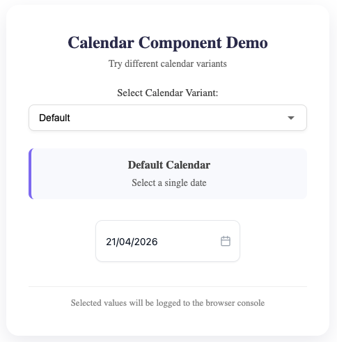
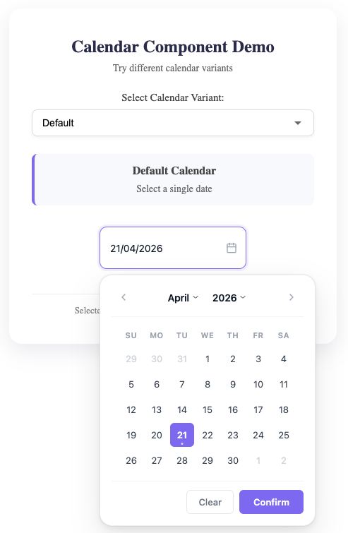
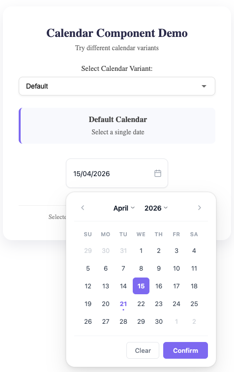
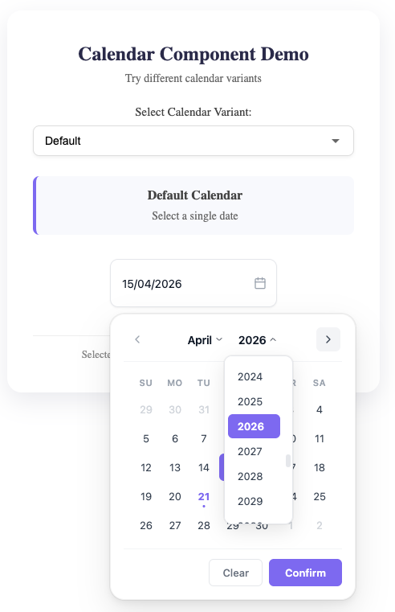
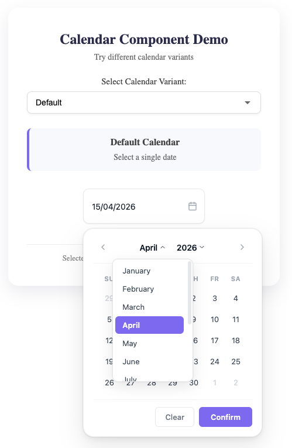
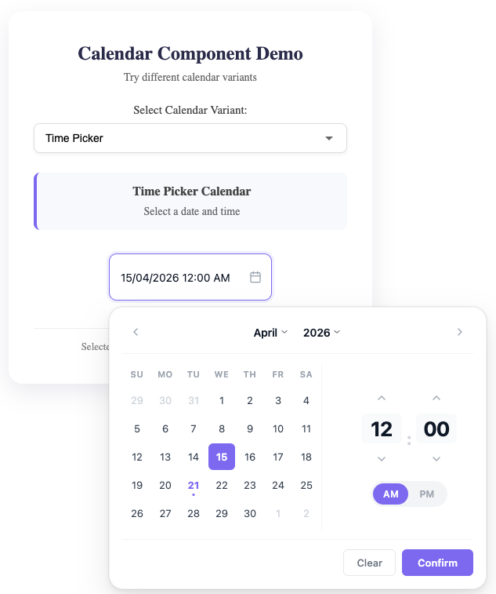
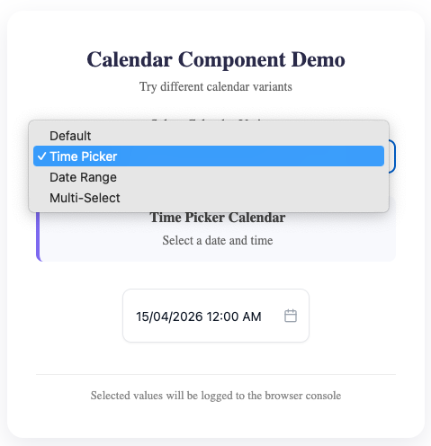
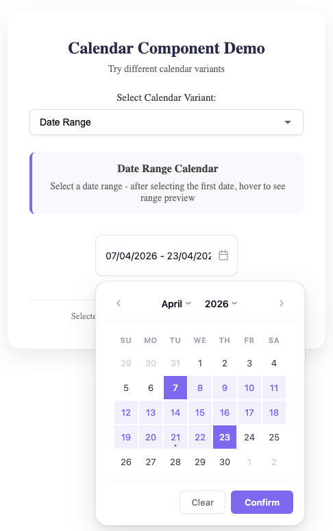
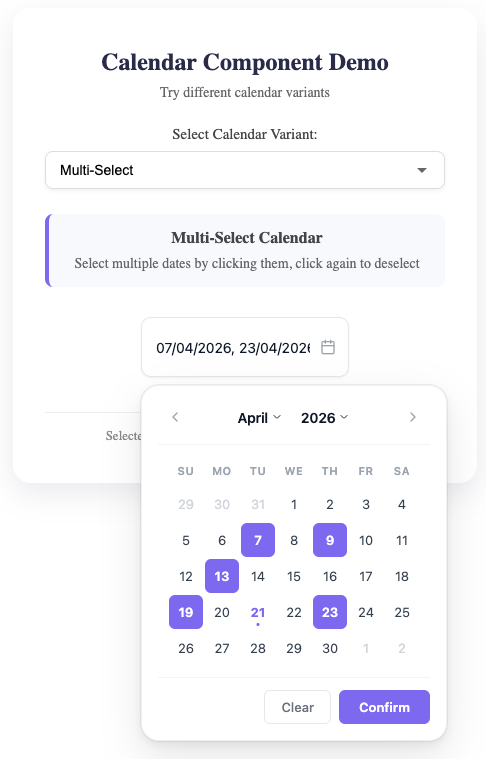

<div align="center">

# react-modern-datetime-picker

**A modern, enterprise-grade React calendar & datetime picker component**

[](https://www.npmjs.com/package/react-modern-datetime-picker)
[](https://www.npmjs.com/package/react-modern-datetime-picker)
[](https://bundlephobia.com/package/react-modern-datetime-picker)
[](https://www.typescriptlang.org/)
[](https://react.dev/)
[](https://github.com/DevCodeSpace/react-modern-datetime-picker/blob/main/LICENSE)
[](https://github.com/DevCodeSpace/react-modern-datetime-picker)

Built with TypeScript · Zero runtime dependencies · Fully themeable · Production ready

</div>

---

## Preview

<div align="center">

### Default Date Picker


&nbsp;&nbsp;


### Selected Date · Date Picker



### Year & Month Dropdowns


&nbsp;&nbsp;


### Time Picker


&nbsp;&nbsp;


### Date Range · Multi-Select


&nbsp;&nbsp;


</div>

---

## Overview

**react-modern-datetime-picker** is a powerful, highly customizable calendar and datetime picker component for React applications. Designed with a modern material UI, it supports multiple picker variants — from simple date selection to full datetime picking with time controls, date ranges, and multi-date selection — all in a single, lightweight package.

Whether you're building a booking system, a scheduling dashboard, or a data-entry form, react-modern-datetime-picker gives you complete control over appearance, behavior, and accessibility.

---

## Features

| | Feature | Description |
|---|---|---|
| 🗓 | **4 Picker Variants** | Default, Time, Range, Multi-select |
| 🎨 | **Full Theme Control** | Customize every color — primary, background, text, borders, hover |
| 🧩 | **Custom Icons** | Inject any React node as the input icon, left or right |
| 🌍 | **Internationalization** | Locale support, custom date formats, configurable week start |
| 🔒 | **Date Constraints** | Min/max dates, disabled dates, disabled days of week |
| ⏰ | **Time Picker** | 12 / 24 hour format, minute intervals, optional seconds |
| ⌨️ | **Keyboard Navigation** | Full accessibility with ARIA support |
| 📦 | **Zero Dependencies** | Only peer deps: `react` and `react-dom` |
| 🔷 | **TypeScript First** | Complete type definitions included |
| 📱 | **Responsive** | Mobile-aware modal positioning |

---

## Installation

```bash
# npm
npm install react-modern-datetime-picker

# yarn
yarn add react-modern-datetime-picker

# pnpm
pnpm add react-modern-datetime-picker
```

> **Peer dependencies required:** `react >= 18.0.0` and `react-dom >= 18.0.0`

---

## Quick Start

```tsx
import { Calendar } from 'react-modern-datetime-picker'
import 'react-modern-datetime-picker/dist/style.css'

export default function App() {
  return (
    <Calendar
      onChange={(date) => console.log(date)}
    />
  )
}
```

---

## Variants

### Default — Date Picker

```tsx
import { useState } from 'react'
import { Calendar } from 'react-modern-datetime-picker'
import 'react-modern-datetime-picker/dist/style.css'

function DatePickerExample() {
  const [date, setDate] = useState<Date | null>(null)

  return (
    <Calendar
      variant="default"
      value={date}
      onChange={(val) => setDate(val as Date)}
      clearable
    />
  )
}
```

---

### Time — Date & Time Picker

```tsx
<Calendar
  variant="time"
  timeFormat="12"
  timeInterval={15}
  onChange={(val) => console.log('Date + Time:', val)}
/>
```

---

### Range — Date Range Picker

```tsx
<Calendar
  variant="range"
  onChange={(val) => {
    const [start, end] = val as Date[]
    console.log('From:', start, '→ To:', end)
  }}
/>
```

---

### Multi — Multi-Date Select

```tsx
<Calendar
  variant="multi"
  onChange={(val) => {
    console.log('Selected dates:', val)
  }}
/>
```

---

## Customization

### Custom Theme

```tsx
<Calendar
  theme={{
    primaryColor: '#6366f1',       // selected date background
    backgroundColor: '#ffffff',    // calendar background
    textColor: '#111827',          // default text
    selectedTextColor: '#ffffff',  // text on selected date
    todayColor: '#e0e7ff',         // today highlight
    borderColor: '#e5e7eb',        // borders
    hoverColor: '#f3f4f6',         // hover state
  }}
  onChange={(val) => console.log(val)}
/>
```

---

### Custom Icon

```tsx
<Calendar
  icon={{
    icon: <MyIcon />,
    position: 'left',
  }}
  onChange={(val) => console.log(val)}
/>
```

---

### Input Styling

```tsx
<Calendar
  inputStyles={{
    placeholder: 'Select a date',
    className: 'my-custom-input',
    style: { borderRadius: '8px', fontSize: '14px' },
    defaultStyles: true,
  }}
  onChange={(val) => console.log(val)}
/>
```

---

### Date Constraints

```tsx
<Calendar
  minDate={new Date('2024-01-01')}
  maxDate={new Date('2024-12-31')}
  disabledDays={[0, 6]}                     // disable weekends
  disabledDates={[new Date('2024-06-15')]}  // specific dates
  yearRange={[2020, 2030]}
  onChange={(val) => console.log(val)}
/>
```

---

## Props Reference

### Core Props

| Prop | Type | Default | Description |
|------|------|---------|-------------|
| `variant` | `'default' \| 'time' \| 'range' \| 'multi'` | `'default'` | Picker mode |
| `value` | `Date \| Date[] \| null` | `null` | Controlled value |
| `onChange` | `(val: Date \| Date[] \| null) => void` | — | Change callback |
| `format` | `string \| DateFormat` | `'dd/mm/yyyy'` | Date display format |
| `disabled` | `boolean` | `false` | Disable the picker |
| `readOnly` | `boolean` | `false` | Input is non-interactive |
| `clearable` | `boolean` | `true` | Show clear button |
| `updateOnChange` | `boolean` | `false` | Fire onChange on each click without Confirm |
| `closeOnSelect` | `boolean` | `true` | Auto-close after selection |
| `zIndex` | `number` | `1000` | Modal z-index |
| `className` | `string` | — | Wrapper class |
| `style` | `React.CSSProperties` | — | Wrapper inline style |

---

### Constraint Props

| Prop | Type | Description |
|------|------|-------------|
| `minDate` | `Date` | Earliest selectable date |
| `maxDate` | `Date` | Latest selectable date |
| `disabledDates` | `Date[]` | Specific dates to block |
| `enabledDates` | `Date[]` | Whitelist — only these dates selectable |
| `disabledDays` | `number[]` | Days of week to block (0=Sun … 6=Sat) |
| `yearRange` | `[number, number]` | Restrict year dropdown range |

---

### Display Props

| Prop | Type | Default | Description |
|------|------|---------|-------------|
| `locale` | `string` | — | e.g. `'en-US'`, `'de-DE'` |
| `weekStart` | `0 \| 1 \| 6` | `0` | Week start: Sun=0, Mon=1, Sat=6 |
| `highlightToday` | `boolean` | `true` | Highlight current date |
| `highlightWeekends` | `boolean` | `false` | Highlight Sat & Sun |
| `showOtherMonths` | `boolean` | `true` | Show adjacent month dates |
| `selectOtherMonths` | `boolean` | `true` | Allow clicking adjacent month dates |

---

### Time Picker Props

> Only active when `variant="time"`

| Prop | Type | Default | Description |
|------|------|---------|-------------|
| `timeFormat` | `'12' \| '24'` | `'12'` | Hour display format |
| `timeInterval` | `number` | `1` | Minute step |
| `showSeconds` | `boolean` | `false` | Show seconds selector |

---

### Callback Props

| Prop | Type | Description |
|------|------|-------------|
| `onOpen` | `() => void` | Fired when calendar opens |
| `onClose` | `() => void` | Fired when calendar closes |
| `onMonthChange` | `(date: Date) => void` | Fired on month navigation |
| `onYearChange` | `(date: Date) => void` | Fired on year change |
| `onError` | `(error: string) => void` | Fired on validation error |

---

## TypeScript

All types are exported and ready to use:

```tsx
import type {
  CalendarProps,
  CalendarVariant,
  CalendarTheme,
  CalendarIcon,
  InputStyles,
  DateFormat,
  WeekStart,
} from 'react-modern-datetime-picker'
```

### Theme Type

```ts
type CalendarTheme = {
  primaryColor?: string
  backgroundColor?: string
  textColor?: string
  selectedTextColor?: string
  todayColor?: string
  borderColor?: string
  hoverColor?: string
}
```

### Icon Type

```ts
type CalendarIcon = {
  icon?: React.ReactNode
  position?: 'left' | 'right'
  className?: string
  style?: React.CSSProperties
}
```

---

## Browser Support

| Browser | Support |
|---------|---------|
| Chrome | ✅ Latest |
| Firefox | ✅ Latest |
| Safari | ✅ Latest |
| Edge | ✅ Latest |
| Mobile (iOS / Android) | ✅ Responsive |

---

## Contributing

Contributions are welcome! Please open an issue or submit a pull request on [GitHub](https://github.com/DevCodeSpace/react-modern-datetime-picker).

- [Report a bug](https://github.com/DevCodeSpace/react-modern-datetime-picker/issues)
- [Request a feature](https://github.com/DevCodeSpace/react-modern-datetime-picker/issues)
- [View source](https://github.com/DevCodeSpace/react-modern-datetime-picker)

---

## License

MIT © [devcodespace](https://github.com/DevCodeSpace)

---

<div align="center">

If this package helps your project, consider giving it a ⭐ on [GitHub](https://github.com/DevCodeSpace/react-modern-datetime-picker).

**Built with React + TypeScript · Maintained by [DevCodeSpace](https://github.com/DevCodeSpace)**

[GitHub](https://github.com/DevCodeSpace/react-modern-datetime-picker) · [npm](https://www.npmjs.com/package/react-modern-datetime-picker) · [Report Issue](https://github.com/DevCodeSpace/react-modern-datetime-picker/issues)

</div>
